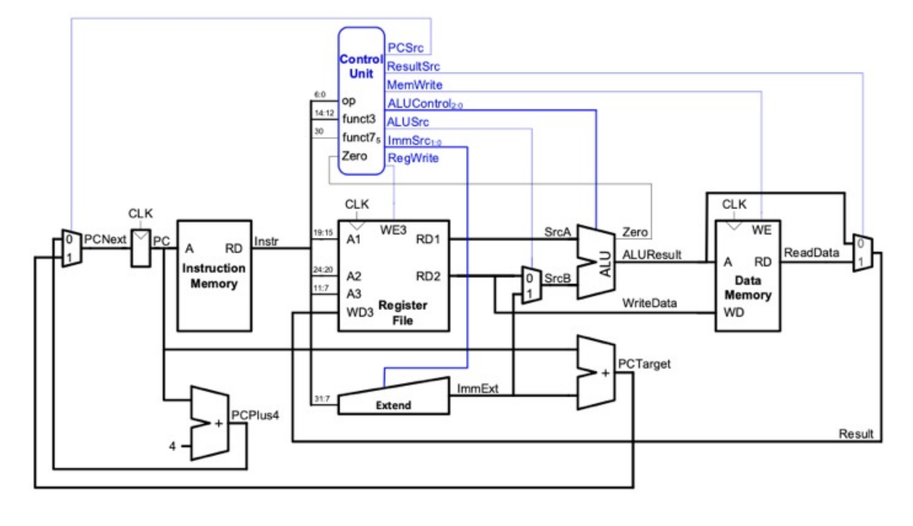

# Team Progress

This file will note down **major meetups** and breakdown the progress completed by those meetups. Note that only meetings with all 4 members present will be documented in this file.

## Lab meetup (14/11)
  - Discussed and allocated lab 4 parts to team members
    
    This covers the role allocation for lab 4 only
    

  - Team goals:
    1. Lab 4 design
    2. Single cycle
    3. Pipeline
    4. Hazard detection, stall, flush
    5. Cache memory & branch prediction

## Lab meetup (21/11)
  - Lab 4 parts were mostly completed before the lab meetup
  - Some amendments were made such as amending the control unit and instruction memory files (Jihwan & Ahmed), whilst Elson and Antoine worked on role allocation and reformatting the repo. 
  - Main issues discussed during meeting:
    - In what order should do everything
    - Set a timeline
    - Split roles, set what should be done individually, what should be done collectively (namely pipelining, cache & branch prediction)
    - Start tracking logbooks for team meetings
    - Meet 3 times a week to keep the momentum going for the project
    - We decided to each individually test our own modules, Jihwan (in charge of the testbench) would mainly be focused on the integration for example.
    - In terms of role allocation:
        - Antoine: ALU
        - Elson: Register File
        - Ahmed: Control Unit
        - Jihwan: Integration and integrated testbenching

## Team meetup (27/11)
  - We met for several hours in order to debug our code, including the possibility of using gtkwave
  - We implemented modules from the repo provided by the UTAs
  - We edited the modules and testbenches we previously had
  - We went from 1 out of 6 test cases passed to 3 out of 4
  - We managed to successfully debug many issues, ranging from the wrong number of bits, syntax errors, naming issues... - we used VSCode's LiveShare feature for this. It was a team effort which took many hours and the changes were committed by Antoine but it was a team task in which everyone got to participate.
  - We started discussing implementing the hazard control and pipelining later on
    

## Lab meetup (28/11)
  - We had some errors with the integration
  - Use of gtkwave for debugging
  - We had issues with the ALU testbench and control unit testbench which we made ourselves, as well as the MUX testbench (which was provided to us), which were working the day before but somehow only started working once we commented out the following lines from the doit.sh script:
    
#if [ $name=="verify.cpp" ]; then

#name="top"

#fi

  - We commented the doit.sh script to get a better understanding of what each line was doing, and then tried to make testbenches for the rom and sign extension modules
  - We noticed we'll have to amend some modules and testbenches in order to go from lab 4 to the finalised coursework
  - We had a lot of modules up and running by the end of the day

## Team meetup (29/11)
  - We met today for more debugging
  - Edited modules for program counter and rom
  - Adjusted program counter, rom and top testbenches
  - Went through the instructions for the project to split the tasks more appropriately, redefine the timeline
  - First time all tests ran successfully! 

## Team meetup (30/11)
  - Changed the ROM so it can take the instructions from the compiled hex file
  - Deleted program.s as it was identical to the counter.s file we had
  - Implemented a instr_mem.sv module, as well as the corresponding instr_mem_tb.cpp testbench
  - We then tested the instruction memory, and using verilator we saw it was fully functional
 
  - We had some issues running gtkwave, but after correcting the relevant syntax error, we could see the first few cycles in gtkwave of our counter.s program running on our CPU

and the last few cycles resemble this:

  - This officially completes lab 4!
  - We can now move onto the pipelining, hazard control...

## Team meetup (01/12)
  - Went over the project brief instructions
  - Created a new branch for single cycle, and the README for the rtl folder
  - Allocated roles for the next few days, from the f1 assembly file, to amending the sign extension or implementing the data memory

## Team meetup (02/12)
  - Ahmed fixed the sign extension module and testbench, then amended the top file accordingly
  - Ahmed and Antoine worked on implementing the data memory module as well as the data memory test (little_endian.s)
  - Ahmed and Antoine had to add a AddrMode signal, which also had to be added to the control unit module
  - Elson worked on the f1 lights module and testbench
  - The next objective is to implement the data memory and pdf testbench 

## Team meetup (04/12)
  - We met today to debug the pdf testbench, the data memory testbench (included in the top testbench), instruction memory testbench too
  - We used gtkwave to verify the correct values were appearing
  - We're also running tests on the f1 assembly file and testbench

## Team meetup (05/12)
  - We ran a fully functional data memory for the first time, hence concluding single cycle

  - We then ran some tests using the pdf testbench and f1 lights

